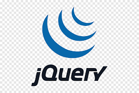

# TradingPost App
___


<a href="https://www.python.org/" title="Python"></a> &nbsp;<a href="https://developer.mozilla.org/en-US/docs/Web/JavaScript" title="JavaScript"></a>&nbsp; <a href="https://git-scm.com/" title="Git"></a>&nbsp; <a href="https://www.w3.org/TR/html5/" title="HTML5"></a>&nbsp; <a href="https://www.w3.org/TR/CSS/" title="CSS3"></a>&nbsp; <a href="https://code.visualstudio.com/" title="Visual Studio Code"></a> &nbsp;<a href="https://www.npmjs.com/package/axios" title="AXIOS"></a> &nbsp;<a href="https://www.heroku.com/" title="Heroku"></a> &nbsp;<a href="https://www.postgresql.org/" title="Postgres"></a> &nbsp;<a href="https://getbootstrap.com/" title="Bootstrap"></a> &nbsp;<a href="https://fontawesome.com/" title="FontAwesome"></a> &nbsp;<a href="https://jquery.com/" title="jQuery"></a> &nbsp;<a href="https://flask.palletsprojects.com/en/1.1.x/" title="Flask"></a> &nbsp;<a href="https://www.sqlalchemy.org/" title="Git"></a> &nbsp;<a href="https://wtforms.readthedocs.io/en/2.3.x/#" title="WTForms"></a>


## About
Got some hot tips on a certain stock? Want customized news based on your stock watchlist? Or you want a community that revolve around stock market..
<br> 
<div align='center'>This is it</div>
<div align='center'>-TradingPost-</div>
<div align='center'>Come join Us!</div>
<br>


## Installation 
You will need python3 and pip3 installed for this project.
You will also need to setup a Postgres Database for the app.

1. Clone the repo.
    ```sh
    https://github.com/erikamanning/capstone1.git
    ```

2. Create a virtual environment in the project directory.
    ```sh 
    $ python3 -m venv venv
    ```

3. Start the virtual environment.
    ```sh
    $ source venv/bin/activate
    ```

4. Install required packages.
    ```sh
    $ pip3 install requirements.txt